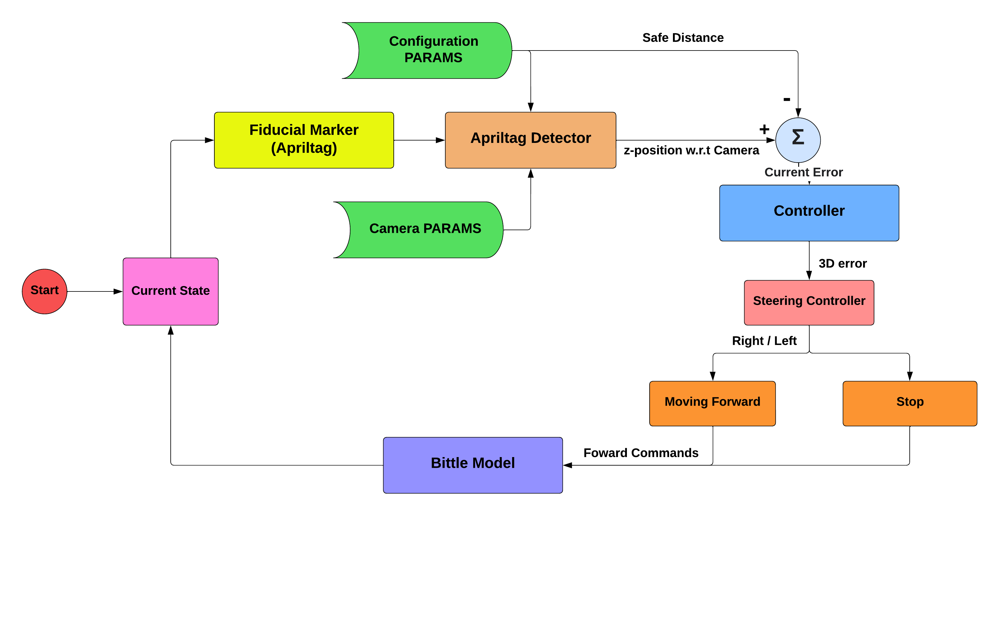

# Robust Fiducial Markers Detection And Following Using Quadruped Robot

[](http://wiki.ros.org/)
[](https://www.python.org/downloads/release/python-360/)
[](https://gazebosim.org/home)
[](https://reactjs.org/)

<br />
<br />
<br />



# Project Structure

- ## 1- main: (Main and final implementation of apriltag following process from v0:v4)

      - **AprilTagFollowerFinal_v0**:  First version of apriltag follower and robot controller proecess.
      - **AprilTagFollowerFinal_v4**:  Final implementation of apriltag following proecess.

  <br />

- ## 2- utils : (helper files for apriltag detection)

  - **CameraCalibration**: This script is for generating camera parameters like K matrix, distortion array .
  - **ApriltagDetector**: To Detect the apriltag using the above calibrated camera and estimate its position.
  - **Controller**: To control the bittle robot using by sending serial commands from raspberrypi to NyBoard.
  - **SerialCommunication, ardSerial**: those utils' contain the main functions required for serial communication.
  - **main**: This is the main script that implement the complete process by estimating the camera position using [ApriltagDetector](https://collaborating.tuhh.de/b1/teaching/classes/construction-robotics-ws-2022_23/-/blob/group1/bittle_ws/ApriltagDetector.py) and controlling bittle robot using [controller](https://collaborating.tuhh.de/b1/teaching/classes/construction-robotics-ws-2022_23/-/blob/group1/bittle_ws/controller.py)

  - **calibrationResults.yaml**: This yaml file contains the camera parameters like K matrix and distortion array.
  - **settings.yaml**: This configuration file used to dynamically change some required parameters during the control process such as:
    remoteControl, aprilTagLocalization.

<br />

- ## 3- CNN: (Pretrained- CNN Model)
  - Trial implementation of Convolution Neural Network pretrained model to estimate Apriltag position.

<br />

<br />

|                                                                    Bittle Model                                                                     |                                             Apriltags                                              |
| :-------------------------------------------------------------------------------------------------------------------------------------------------: | :------------------------------------------------------------------------------------------------: |
|  |  |

# Getting Started

# 1- Simulation (simulation)

> **_NOTE:_** <br />
> 1- This Robot model urdf is cloned from this repo, [Bittle_URDF](https://github.com/AIWintermuteAI/Bittle_URDF) <br /> 2- while the JointEffortService and the mixer implemenation has been cloned from this repo [notspot_sim_py](https://github.com/lnotspotl/notspot_sim_py)

<p align="center">

</p>

1. Clone this project.
   -
   ```bash
   $ cd construction-robotics-ws-2022_23/simulation
   ```
2. Building code in a catkin workspace and adding the packages to current running local ros.
   -
   ```bash
   $ catkin_make
   ```
   ```bash
   $ source devel/setup.bash
   ```
3. Open the simulation environment.
   -
   ```bash
   $ roslaunch bittle_gazebo simulation.launch
   ```
4. Spawn Bittle Model (in new terminal).
   -
   ```bash
   $ source devel/setup.bash
   ```
   ```bash
   $ roslaunch bittle_gazebo spawn_robot.launch
   ```
5. ## Estimate the camera distance to the apriltag (in new terminal).
   ```bash
   $ source devel/setup.bash
   ```
   ```bash
   $ roslaunch apriltag_pose_estimation apriltag_detector.launch
   ```
6. Follow apriltag (in new terminal).
   -
   ```bash
   $ source devel/setup.bash
   ```
   ```bash
   $ roslaunch apriltag_follower apriltag_follower.launch
   ```

# 2- Actual Implementation (main)

<br />

1. Clone this project.

   -

   ```bash
   $ git clone -b group1 git@collaborating.tuhh.de:b1/teaching/classes/construction-robotics-ws-2022_23.git
   ```

2. Go to the workspace:
   -
   ```bash
   $ cd construction-robotics-ws-2022_23/main
   ```
3. Edit main configuration variables in settings.yaml if required:

   -

   ```bash
   remoteControl, aprilTagLocalization, etc...
   ```

4. run final version file:
   -
   ```bash
   $ python AprilTagFollowerFinal_v4.py
   ```

# 3- CNN:

> **_NOTE:_** <br />
> 1- The actual implementation of this Keras model is not mentioned so feel free to use a new model with differnent weights and put it in the same directoty then run the file.

1. Go to directory.

   -

   ```bash
   $ cd construction-robotics-ws-2022_23/CNN
   ```

2. Test model:
   -
   ```bash
   $ python followerwithCNN.py
   ```
