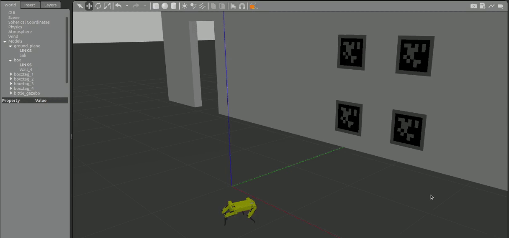

# CNN Supported Robust Fiducial Markers Detection And Following Using Quadruped Robot

[](http://wiki.ros.org/)
[](https://www.python.org/downloads/release/python-360/)
[](https://gazebosim.org/home)
[](https://reactjs.org/)

|                                                                    Bittle Model                                                                     |                                             Apriltags                                              |
| :-------------------------------------------------------------------------------------------------------------------------------------------------: | :------------------------------------------------------------------------------------------------: |
|  |  |

# Getting Started

# 1- Implementation

> **_NOTE:_** <br />
> 1- This Robot model urdf is cloned from this repo, [Bittle_URDF](https://github.com/AIWintermuteAI/Bittle_URDF) <br /> 2- while the JointEffortService and the mixer implemenation has been cloned from this repo [notspot_sim_py](https://github.com/lnotspotl/notspot_sim_py)

<p align="center">

</p>

<br />

1. Clone this project.

   -

   ```bash
   $ git clone SSH or HTTPS
   ```

2. ## Go to the workspace:
   ```bash
   $ cd Final Code Base
   ```
3. Edit main configuration variables in settings.yaml if required:

   -

   ```bash
   remoteControl, aprilTagLocalization, etc...
   ```

4. ## run final version file:
   ```bash
   $ python AprilTagFollowerFinal_v4.py
   ```

# CNN Supported Version:

1. Go to directory.

   -

   ```bash
   $ cd construction-robotics-ws-2022_23/CNN
   ```

2. ## Test model:
   ```bash
   $ python followerwithCNN.py
   $ python AprilTagFollower_withCNNsupport.py
   ```
